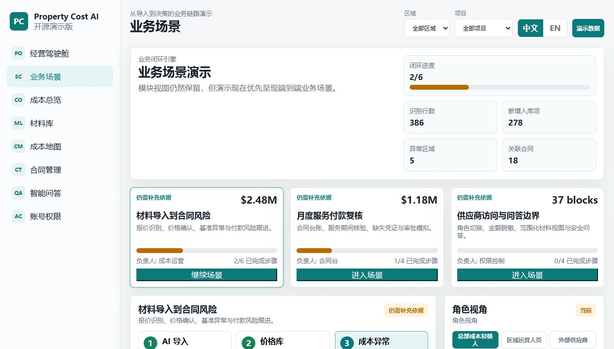
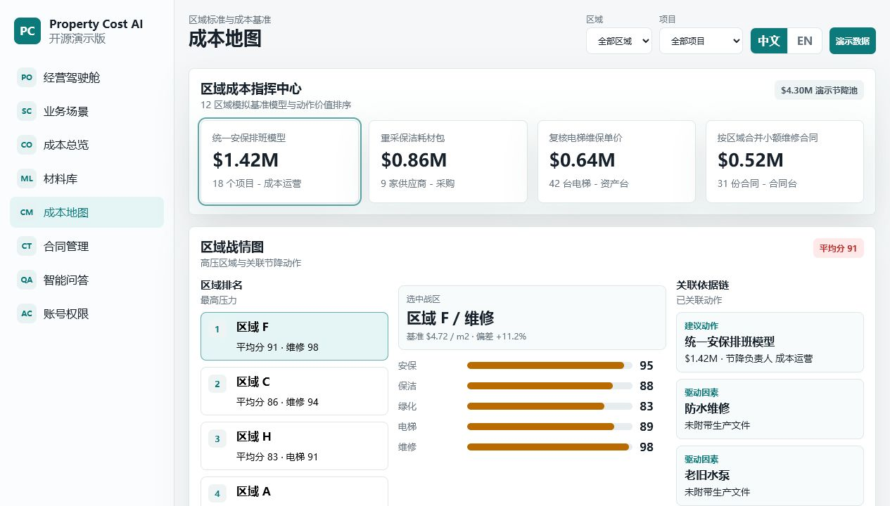
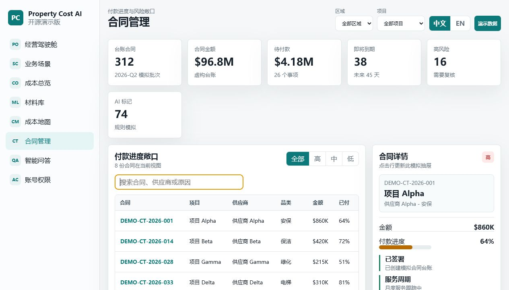
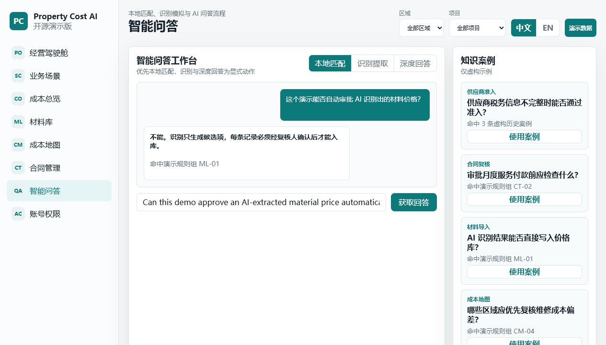

# Property Cost AI Platform Demo

**A sanitized bilingual demo for an AI-assisted property procurement, cost, contract and material operations platform.**

This repository is a public showcase version built for GitHub display. It demonstrates product thinking, executive cockpit design, scenario-driven operations and AI-assisted business workflows without exposing production code, production history, databases, uploads, contracts, prices, accounts or secrets.


Static front-end | Mock data only | No backend | Chinese / English | Live on GitHub Pages

## Live Demo

Open the public demo:

```text
https://lwxy000.github.io/property-cost-ai-platform-demo/
```

## 中文摘要

这是一个面向 GitHub 展示的脱敏 Demo，用来呈现“物业 / 采购 / 成本 / 合同 / 材料 / 智能问答 / 权限中心”一体化运营平台的产品能力。

它不是生产仓库公开版，也不是从生产仓库 fork 出来的项目。所有数据都是虚构样例，所有交互都运行在浏览器本地状态中，不连接生产 PostgreSQL，不读取真实 `.env`、上传文件、合同附件、材料价格、成本数据、服务器信息或内部账号。

## What To Try First

Use this short path when reviewing the demo:

1. Open the executive cockpit and read the portfolio-level pressure signal.
2. Trigger the one-click decision chain to simulate a full material-cost-contract-AI workflow.
3. Enter the guided business scenario view and watch the local progress, evidence chain and decision summary update.
4. Open the cost map to inspect regional pressure, risk radar, savings actions and anomaly signals.
5. Review contracts, material AI import, Smart Q&A and account masking to see how the modules connect.
6. Switch between Chinese and English, then preview different permission perspectives.

Local routes after starting the server:

- `http://127.0.0.1:4173/#portal`
- `http://127.0.0.1:4173/#scenarios`
- `http://127.0.0.1:4173/#costMap`
- `http://127.0.0.1:4173/#contracts`
- `http://127.0.0.1:4173/#smartQA`
- `http://127.0.0.1:4173/#accounts`

## Screenshots

### Executive Cockpit


### Guided Business Scenario



### Regional Cost Map



### Contract Management



### Smart Q&A



## Product Story

The demo is designed around a realistic operating loop:

An operations leader sees abnormal cost pressure in a regional portfolio, drills into the cost map, checks material price evidence, reviews contract payment and renewal risk, asks the AI assistant for a structured explanation, and shares a masked view with the right role permissions.

The goal is not to show isolated screens. The goal is to show how an AI-enabled operating platform helps a property business move from signal, to evidence, to decision, to controlled execution.

## Highlights

- Executive cockpit with focused portfolio KPIs, risk rail, AI evidence trail and savings leaderboard
- Scenario engine that connects material import, price review, cost-map anomaly, contract risk, Q&A and role masking
- Regional cost map with battle-map ranking, risk radar, pressure heat matrix and action pool
- Material price library with reviewer-confirmed rows, exception flags and AI import candidates
- Material AI import mock flow covering upload, recognition, review and confirmation states
- Contract management with payment progress, renewal risk, searchable ledger and detail drawer actions
- Smart Q&A with typed questions, case matching, vision extract and deep answer mock states
- Account and permission center with selectable roles, visitor masking and data-scope preview
- Chinese / English language switch using local browser state

## Interactive Scope

This is a static-hostable demo, but it is not a static screenshot.

The browser experience includes:

- hash-based navigation
- language switching
- searches and filters
- review drawers
- mock workflow actions
- AI import steps
- heat-map drilldowns
- Q&A matching
- role-based masking previews
- one-click business-chain simulation
- generated decision summaries from fictional local state

No API service, model endpoint, database, object storage or account service is called.

## Demo Scale Snapshot

The fictional operating model is intentionally broad enough to communicate enterprise product scope:

- 86 managed projects across a synthetic 12-region portfolio
- 18,420 material price rows represented by safe sample records
- 312 contract ledger items summarized through mock risk KPIs
- 3,842 AI knowledge matches and 1,284 simulated review tasks
- $4.30M in fictional cost-map savings opportunities

These numbers are presentation data only. They are not production metrics.

## Safety Boundary

This repository is safe for public demonstration because it follows these boundaries:

- independent repository, not a public fork of production history
- no production PostgreSQL connection
- no real `.env`, access token, certificate, private key or server credential
- no real upload files, contract attachments, invoices, spreadsheets or database dumps
- no real material prices, supplier records, project costs or operating ledgers
- no company domain, server IP, internal account or private deployment detail
- no backend runtime required for the demo experience

All organizations, regions, projects, suppliers, contracts, prices, dates and Q&A cases are fictional or visibly sanitized.

## Tech Stack

- Plain HTML
- CSS
- Vanilla JavaScript
- Local mock data
- Python static file server through `npm run dev`
- Node syntax check through `npm run check`

Repository layout:

```text
.
├── index.html
├── src/
│   ├── app.js
│   ├── data.js
│   └── styles.css
├── public/
│   └── assets/
├── docs/
├── package.json
└── README.md
```

## Run Locally

```bash
npm run dev
```

Then open:

```text
http://127.0.0.1:4173/
```

There are no npm package dependencies. Python is used only to serve the static files locally.

## Validate Before Publishing

```bash
npm run check
```

Before enabling any public hosting, also perform a manual sensitivity scan for:

- `.env`
- `data/`
- `uploads/`
- database dumps or SQLite files
- spreadsheets or contract attachments
- real domains, server IPs, internal accounts or secrets
- real project names, supplier names, prices, contract numbers or cost ledgers

## GitHub Pages

The demo is published through GitHub Pages:

```text
https://lwxy000.github.io/property-cost-ai-platform-demo/
```

Recommended release discipline:

1. keep the repository independent from production;
2. run `npm run check`;
3. complete the manual sensitivity scan;
4. capture final screenshots or a short GIF walkthrough;
5. update the public demo only after the review is clean.

## Documentation

- [Demo scope](docs/demo-scope.md)
- [Data sanitization](docs/data-sanitization.md)
- [Product story](docs/product-story.md)
- [Business scenarios](docs/business-scenarios.md)
- [Public release checklist](docs/public-release-checklist.md)

## License

MIT License. See [LICENSE](LICENSE).
