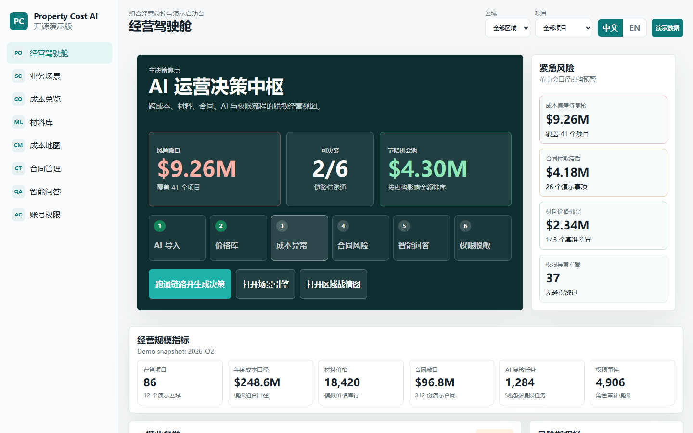

# Property Cost AI Platform Demo

A sanitized interactive front-end mock for an AI-enabled property operations platform.



This repository is designed for GitHub display only. It is not a fork of any production repository, does not contain production history, does not connect to any database, and does not include real business data.

The demo can be hosted as static files, but the browser experience is interactive: filters, searches, review drawers, mock workflow actions, AI import steps, heat-map drilldowns, Q&A matching and permission previews all run in local front-end state.

The interface supports Chinese and English. Chinese is the default language because the operating scenarios are closer to Chinese property/procurement workflows, while English remains available for GitHub portfolio display.

Current focus: this repository is being refined locally from a module showcase into a portfolio-ready business-scenario demo. It is not connected to any public remote yet.

## What It Shows

- Executive cockpit first screen with portfolio KPIs, risk rail, savings leaderboard and AI evidence trail
- Chinese / English language switch with local browser state
- Guided business scenarios that connect material import, price library review, cost-map anomaly, contract risk, Smart Q&A and permission masking
- Closed-loop scenario engine with local progress, operation log, evidence chain, role perspective and generated decision summary
- One-click business-chain simulation that completes a full sanitized workflow in browser state
- Portfolio command center with synthetic region, project and risk signals
- Cost overview with 12-month budget, actual, paid and variance mock data
- Material price library with reviewer-confirmed rows and AI import candidates
- Material AI import flow with upload, recognition, review and confirm mock steps
- Cost map with regional battle-map ranking, risk radar, pressure heat matrix and action pool
- Contract payment progress, risk filtering, searchable ledger and detail drawer actions
- Smart Q&A with typed questions, case matching, vision extract and deep answer mock states
- Account and permission center with selectable roles and visitor masking

## Demo Scale Snapshot

The public demo now uses a richer fictional operating model:

- 86 managed projects across a synthetic 12-region portfolio
- 18,420 material price rows represented by safe sample records
- 312 contract ledger items summarized through mock risk KPIs
- 3,842 AI knowledge matches and 1,284 simulated review tasks
- A cost-map action pool with $4.30M in fictional savings opportunities

These numbers are designed to communicate product scope. They are not production metrics.

## Interaction Model

The scenario page behaves like a browser-only operations workbench:

- Scenario progress is stored in local front-end memory for the current session.
- Mock actions mark steps complete and append operation-log entries.
- Role view changes evidence masking without calling any account service.
- Decision summaries are generated from fictional scenario state only.

The executive cockpit adds a GitHub-friendly first impression:

- a high-density operating snapshot instead of a simple module menu;
- a one-click chain that runs material import, cost anomaly, contract risk, Smart Q&A and permission masking;
- a regional battle-map preview that links pressure rankings to savings actions;
- an evidence trail that shows how modules connect without exposing real attachments.

## Demo Data Notice

All organizations, regions, projects, suppliers, contracts, prices, dates and question-answer cases are fictional. The asset in `public/assets/design-direction.png` was generated as a visual design direction and contains only mock labels.

No production files are required or expected.

## Run Locally

```bash
npm run dev
```

Then open:

```text
http://127.0.0.1:4173/
```

The app is plain HTML, CSS and JavaScript. There are no npm dependencies and no server-side runtime.

## Checks

```bash
npm run check
```

Before publishing, also run a manual scan for forbidden content:

- `.env`
- `data/`
- `uploads/`
- database dumps or SQLite files
- spreadsheets or contract attachments
- real domains, server IPs, internal accounts or secrets

## Why This Shape

The first public version is intentionally static-hostable, not interaction-free. This keeps it safer for open-source display while still demonstrating product workflows through front-end mock state. It can later be published through GitHub Pages after a final sensitivity review.

## Documentation

- [Demo scope](docs/demo-scope.md)
- [Data sanitization](docs/data-sanitization.md)
- [Product story](docs/product-story.md)
- [Business scenarios](docs/business-scenarios.md)
- [Public release checklist](docs/public-release-checklist.md)
