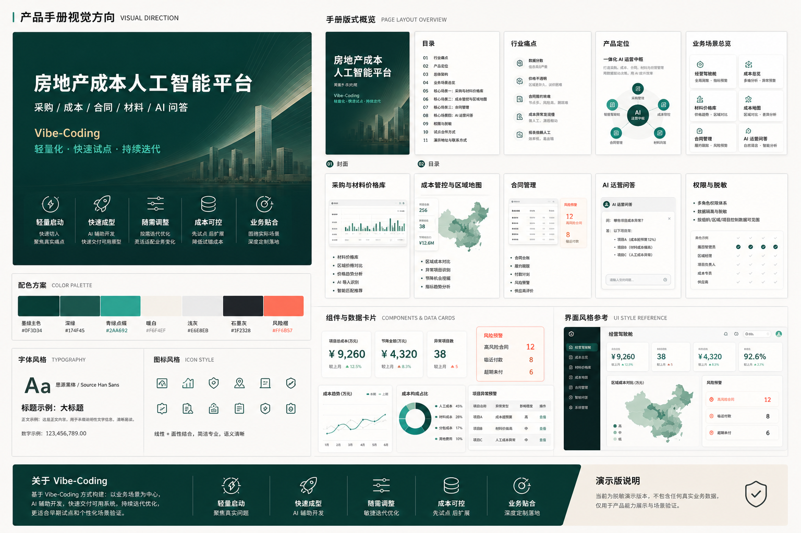

# Product Handbook Visual Direction

This document records the visual direction used for the public product handbook.

The direction was generated with IMAGE-2 as a design advisor before implementing the handbook copy and page layout.

## Design Intent

- Mature enterprise SaaS, not a casual personal project page.
- Executive presentation feel, suitable for property, procurement, cost and contract stakeholders.
- Clear business credibility: operating cockpit, material pricing, cost map, contract risk and AI Q&A.
- Lightweight Vibe-Coding positioning: quick pilot, fast iteration, cost controlled, business-fit.
- Sanitized public-demo boundary: no real company data, no production screenshots, no secrets.

## Palette

- Deep ink green for authority and continuity with the demo cockpit.
- Warm off-white for product-handbook clarity.
- Graphite gray for professional body text.
- Teal accent for AI and workflow signals.
- Small coral accent for risk, alert and business-pressure moments.

## Layout Principles

- Lead with the product promise, then business pain, then platform capability.
- Avoid evenly weighted module catalogs; every module should answer a business question.
- Use screenshot evidence, but frame it with business meaning.
- Keep Vibe-Coding as a product-method differentiator, not as an engineering novelty.
- Keep safety and data-sanitization boundaries visible but secondary to product value.

## Assets

- Visual board: `public/assets/handbook-visual-direction.png`
- Live handbook: `handbook.html`
- Full Chinese copy: `docs/product-handbook.zh.md`
- One-page brief: `docs/one-page-brief.zh.md`

